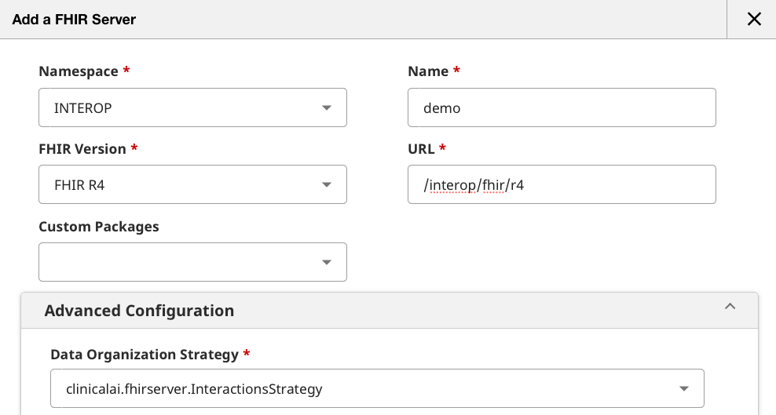
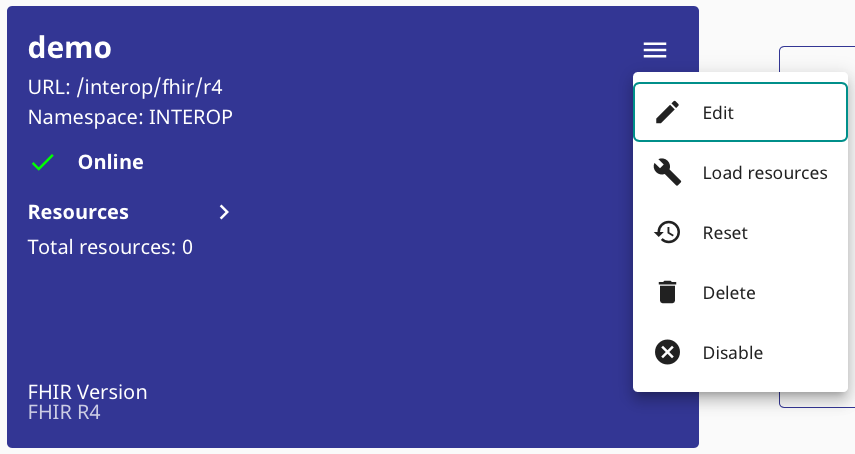

# IRIS Health FHIR Agentic Demo

**Agentic AI for Healthcare** using **InterSystems IRIS for Health** + **CrewAI**

This is a reference demo showing how event-driven, explainable, auditable Agentic AI can be applied to real healthcare workflows.

## What This Demo Shows

When an **abnormal laboratory result** is received (FHIR Observation), an automated multi-agent workflow:

1. 📊 **Collects patient clinical context** (previous labs, medications, conditions)
2. 📚 **Retrieves evidence** from clinical guidelines using RAG (Vector DB)
3. 🧠 **Performs structured clinical reasoning**
4. 💡 **Generates follow-up recommendations**
5. 💾 **Persists explainable reasoning** and evidence in IRIS

> This is not a chatbot. This is event-driven, explainable, auditable Agentic AI for healthcare.

## Architecture Overview

```
┌─────────────────────────────────────────────────────────────────┐
│ 1. FHIR Observation Posted → IRIS FHIR Server                  │
│    Triggers: Business Service (FHIRObservationIn)              │
└─────────────────────────────────────────────────────────────────┘
                              │
                              ▼
┌─────────────────────────────────────────────────────────────────┐
│ 2. Business Process (FollowUpAI)                               │
│    Orchestrates 3-step workflow using BPL                       │
└─────────────────────────────────────────────────────────────────┘
                              │
                              ▼
┌─────────────────────────────────────────────────────────────────┐
│ 3. Business Operation → FastAPI Service (Python/CrewAI)        │
│    • Context Agent (patient data from FHIR)                     │
│    • Guidelines Agent (RAG from Vector DB)                      │
│    • Reasoning Agent (clinical recommendations)                 │
│    Returns: Structured JSON                                     │
└─────────────────────────────────────────────────────────────────┘
                              │
                              ▼
┌─────────────────────────────────────────────────────────────────┐
│ 4. Persistence Operation → SQL Tables                          │
│    • Cases (what happened)                                      │
│    • CaseRecommendations (what to do)                          │
│    • CaseEvidences (why - explainability)                      │
└─────────────────────────────────────────────────────────────────┘
                              │
                              ▼
┌─────────────────────────────────────────────────────────────────┐
│ 5. FHIR Publishing Operation → DiagnosticReport                │
│    Results available via FHIR API                               │
└─────────────────────────────────────────────────────────────────┘
```

For detailed architecture, design principles, and execution models, see [ARCHITECTURE.md](ARCHITECTURE.md).

## Prerequisites

- 🐳 **Docker Desktop** - For running InterSystems IRIS for Health
- 🐍 **Python 3.11+** - For the CrewAI agent workflow
- 🔑 **OpenAI API key** - For GPT-4o and text-embedding-3-small
- 🔌 **VS Code REST Client extension** (recommended) - For testing FHIR endpoints using [samples/fhir.http](samples/fhir.http)

## 🚀 Quick Start

### 1. 📦 Setup Environment

Clone the repository and create a Python virtual environment:

```bash
git clone https://github.com/intersystems-ib/iris-health-fhir-agentic-demo
cd iris-health-fhir-agentic-demo

# Create and activate virtual environment
python3 -m venv .venv
source .venv/bin/activate  # On Windows: .venv\Scripts\activate

# Install Python dependencies
pip install -r requirements.txt
```

### 2. ⚙️ Configure Environment Variables

Copy the example environment file and add your OpenAI API key:

```bash
cp .env.example .env
```

Edit `.env` and set your `OPENAI_API_KEY`:

```env
OPENAI_API_KEY=your_openai_api_key_here
OPENAI_MODEL=gpt-4o-mini

IRIS_HOST=localhost
IRIS_PORT=1972
IRIS_NAMESPACE=INTEROP
IRIS_USERNAME=superuser
IRIS_PASSWORD=SYS

EMBEDDING_MODEL=my-openai-config
```

### 3. 🐳 Start IRIS Container

Build and run the IRIS container:

```bash
docker-compose build
docker-compose up -d
```

### 4. 🏥 Initialize FHIR Server

Create a FHIR R4 repository in IRIS using the Management Portal:

1. Open the IRIS Management Portal: http://localhost:52773/csp/sys/UtilHome.csp
2. Login with credentials: `superuser` / `SYS`
3. Navigate to: **Health** → **INTEROP** → **FHIR Server Management** → **Add New Server**
4. Create a new FHIR Server endpoint:
   - **Namespace**: `INTEROP`
   - **Name**: `demo`
   - **FHIR Version**: `R4``
   - **URL**: `/interop/fhir/r4`
   - **Advanced Configuration → Data Organization Strategy**: `clinicalai.fhirserver.InteractionsStrategy`
   - This strategy class will capture Observation POST events and trigger the Interoperability Production



### 5. 👤 Load Sample FHIR Data

Load the sample patient bundle (Jose Garcia) into the FHIR server.

**Using curl**

```bash
curl -X POST http://localhost:52773/interop/fhir/r4/ \
  -u "superuser:SYS" \
  -H "Content-Type: application/fhir+json" \
  -d @iris/init/fhir/JoseGarcia.json | jq
```

Or using IRIS Management Portal:



This loads:
- Patient: Jose Garcia (MRN-1000001)
- Conditions: Hypertension, CKD Stage 3
- Medications: Ibuprofen (NSAID), Lisinopril
- Lab Results: 3 historical creatinine observations

### 6. 🗄️ Initialize SQL Schema and Vector Database

#### Create SQL Tables

Navigate to [IRIS SQL Explorer](http://localhost:52773/csp/sys/exp/%25CSP.UI.Portal.SQL.Home.zen?$NAMESPACE=INTEROP) (**System Explorer** → **SQL** → **INTEROP**) and run the schema initialization:

```sql
LOAD SQL FROM FILE '/app/iris/init/schema.sql' DIALECT 'IRIS' DELIMITER ';'
```

This creates:
- `clinicalai_data.GuidelineChunks` - Vector DB for clinical guidelines
- `clinicalai_data.Cases` - AI evaluation results
- `clinicalai_data.CaseRecommendations` - Recommended actions
- `clinicalai_data.CaseEvidences` - Evidence citations

#### Configure IRIS Embedding Model

Create the IRIS EMBEDDING configuration for OpenAI:

```sql
INSERT INTO %Embedding.Config (Name, Configuration, EmbeddingClass, VectorLength, Description)
VALUES (
  'my-openai-config',
  '{"apiKey":"your-openai-api-key-here", "sslConfig": "llm_ssl", "modelName": "text-embedding-3-small"}',
  '%Embedding.OpenAI',
  1536,
  'OpenAI text-embedding-3-small for clinical guidelines'
)
```

**Important**: Replace `your-openai-api-key-here` with your actual OpenAI API key.

#### Ingest Clinical Guidelines

Run the ingestion script to embed clinical guidelines into the vector database:

```bash
python iris/vector/ingest_guidelines.py
```

This script:
1. Reads guideline documents from `iris/vector/guidelines/`
2. Chunks them for RAG (800 chars, 150 overlap)
3. Stores chunks in `GuidelineChunks` table
4. Generates embeddings using IRIS `EMBEDDING()` function

**Note**: Add your own clinical guideline documents (`.txt`, `.md`, `.markdown`) to `iris/vector/guidelines/` before running the script.

### 7. ▶️ Run the Demo

#### Start the FastAPI Service

First, start the CrewAI FastAPI service that will be called by the IRIS Business Operation:

```bash
./run_api.sh
```

The service will start on `http://localhost:8000`. You should see output indicating the server is running.

**Note**: Keep this terminal running. Open a new terminal for the next steps.

#### Trigger the Workflow via FHIR POST

**Recommended: Use VS Code REST Client**

Open [samples/fhir.http](samples/fhir.http) in VS Code and execute the "Create new creatinine observation" request (around line 78). This will POST an abnormal lab result that triggers the AI workflow.

**Alternative: Using curl**

```bash
curl -X POST http://localhost:52773/interop/fhir/r4/Observation \
  -u "superuser:SYS" \
  -H "Content-Type: application/fhir+json" \
  -d '{
    "resourceType": "Observation",
    "status": "final",
    "category": [{"coding": [{"code": "laboratory"}]}],
    "code": {
      "coding": [{"system": "http://loinc.org", "code": "2160-0"}],
      "text": "Serum creatinine"
    },
    "subject": {"reference": "Patient/1"},
    "effectiveDateTime": "2026-01-08T10:00:00Z",
    "valueQuantity": {"value": 2.1, "unit": "mg/dL"},
    "interpretation": [{"coding": [{"code": "H"}]}]
  }' | jq
```

This will automatically:
1. Trigger the IRIS Interoperability Production
2. Execute the Business Process (FollowUpAI)
3. Call the FastAPI service to run CrewAI agents
4. Persist results to SQL tables
5. Publish a FHIR DiagnosticReport

#### View Results

**Interoperability Production Messages:**

View message trace in IRIS Management Portal:
- Navigate to: **Interoperability** → **View** → **Messages** or click here in [Message Viewer][http://localhost:52773/csp/healthshare/interop/EnsPortal.MessageViewer.zen?$NAMESPACE=INTEROP&]

For detailed project structure and architecture, see [ARCHITECTURE.md](ARCHITECTURE.md).

**SQL Query Results:**

```sql
-- View all AI evaluation cases (latest first)
-- Shows: Patient, Observation, Risk Level, Confidence, Reasoning Summary
SELECT * FROM clinicalai_data.Cases ORDER BY CreatedAt DESC
```

```sql
-- View all recommendations generated by the AI
-- Shows: Action Type, Action Description, Timeframe
SELECT * FROM clinicalai_data.CaseRecommendations
```

```sql
-- View all clinical evidence used (explainability)
-- Shows: Guideline citations, similarity scores, text excerpts
SELECT * FROM clinicalai_data.CaseEvidences
```

**FHIR DiagnosticReport:**

Use [samples/fhir.http](samples/fhir.http) or curl:

```bash
curl -u "superuser:SYS" \
  "http://localhost:52773/interop/fhir/r4/DiagnosticReport?subject=Patient/1" | jq
```

## 🛠️ Technologies Used

- **InterSystems IRIS for Health** - Clinical data platform with FHIR support
- **CrewAI 0.95.0** - Multi-agent orchestration framework
- **OpenAI GPT-4o** - Language model for clinical reasoning
- **Python 3.11+** - Runtime environment
- **FHIR R4** - Healthcare data standard

## 🎯 Key Design Principles

### ✅ Explainability First

Every recommendation includes:
- Patient context used
- Clinical guidelines referenced (with citations)
- Reasoning explanation
- Confidence level
- Audit trail in IRIS

### 🏥 Healthcare-Realistic

- Conservative language (decision support, not diagnosis)
- Evidence-based recommendations
- Proper disclaimers
- Demo data only (no real patients)

### 🎓 Demo-Oriented

- Simple architecture (no microservices, no message brokers)
- Explainable live in 15 minutes
- Clear audit trail via SQL queries
- Not production-ready (reference implementation)

## 🔗 Accessing IRIS

### 🖥️ IRIS Management Portal

- URL: http://localhost:52773/csp/sys/UtilHome.csp
- Username: `superuser`
- Password: `SYS`
- Namespace: `INTEROP`

### 🌐 FHIR REST API

- Base URL: `http://localhost:52773/interop/fhir/r4`
- Authentication: Basic Auth (`superuser:SYS`)

**Use [samples/fhir.http](samples/fhir.http) for interactive requests**, or use curl:

```bash
# Get all patients
curl -u "superuser:SYS" http://localhost:52773/interop/fhir/r4/Patient | jq

# Get specific observation
curl -u "superuser:SYS" http://localhost:52773/interop/fhir/r4/Observation/1 | jq
```

## 🤝 Contributing

This is a reference demo. Contributions that maintain simplicity and explainability are welcome.

Guidelines:
- Keep the architecture simple and demo-friendly
- Maintain explainability as a core principle
- Follow the design constraints in [ARCHITECTURE.md](ARCHITECTURE.md)
- Ensure changes can be explained in a live demo setting

## 📄 License

MIT License - See LICENSE file for details

## 🙏 Acknowledgments

Inspired by the [InterSystems customer-support-agent-demo](https://github.com/intersystems-ib/customer-support-agent-demo).
